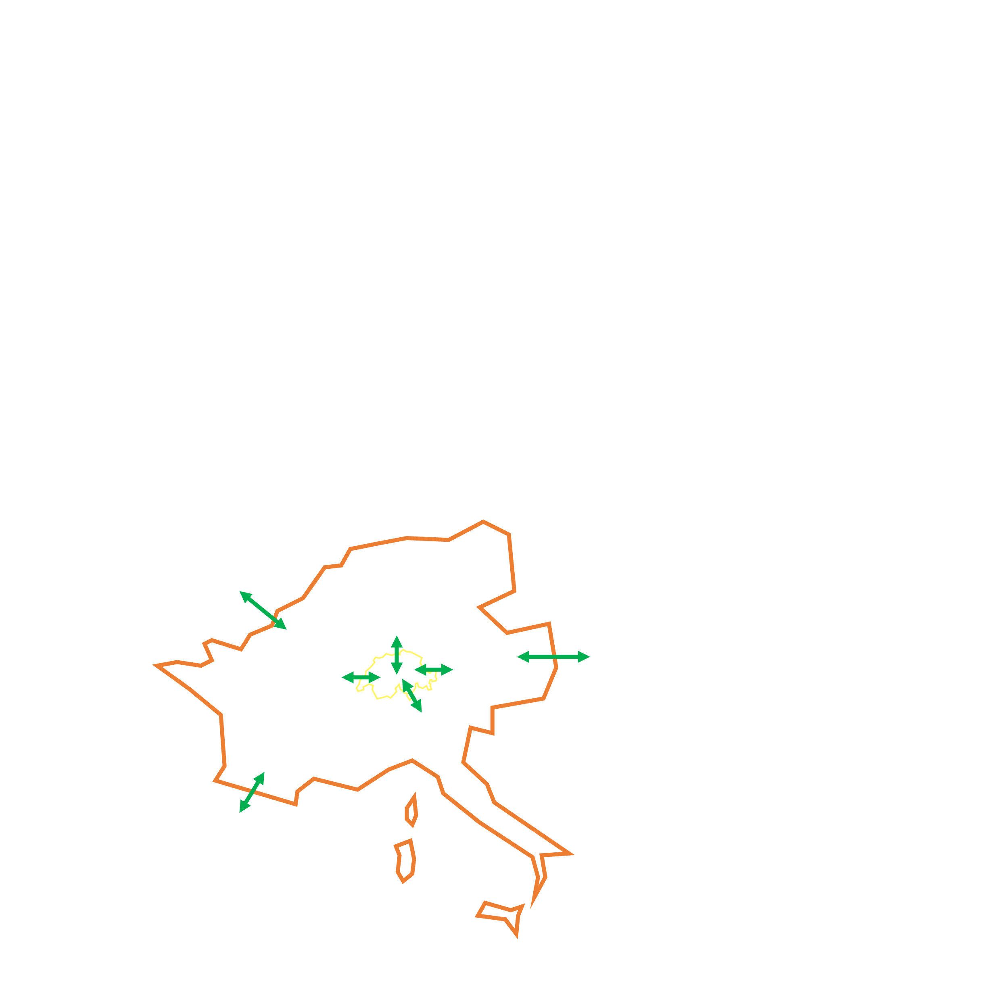

# energy-perspective-2050-switzerland  [](https://doi.org/10.5281/zenodo.6653949)


Description
-----------

This is a repository containing a scenario that implements the projections of the 
Energy Perspective 2050+ report for:

* electricity, 
* hydrogen, 
* gas, 
* and liquid fuels. 

It is meant to be used in `premise` in addition to a global IAM scenario, to provide 
refined projections at the country level.

This data package contains all the files necessary for `premise` to implement
this scenario and create market-specific composition for electricity (including imports from
neighboring countries), liquid and gaseous fuels (including hydrogen).

Sourced from publication
------------------------

Energy perspectives 2050+\
Swiss Federal Office for Energy\
https://www.bfe.admin.ch/bfe/en/home/policy/energy-perspectives-2050-plus.html/

Data validation 
---------------

[](https://goodtables.io/github/premise-community-scenarios/energy-perspective-2050-switzerland)

Test 
----


Ecoinvent database compatibility
--------------------------------

ecoinvent 3.8 cut-off

IAM scenario compatibility
---------------------------

The following coupling is done between IAM and EP2050+ scenarios:

| IAM scenario           | EP2050+ scenario  |
| ---------------------- | ----------------- |
| IMAGE SSP2-Base        | Business As Usual |
| IMAGE SSP2-RCP26       | ZERO Basis        |
| REMIND SSP2-Base       | Business As Usual |
| REMIND SSP2-PkBudg1100 | ZERO Basis        |
| REMIND SSP2-PkBudg900  | ZERO Basis        |

What does this do?
------------------



This external scenario creates the markets for Switzerland listed below according
to the projections from the Energy Perspectives 2050+ (yellow boundaries in map above).

* `market for electricity, high voltage, EP2050` (CH)
* `market for electricity, medium voltage, EP2050` (CH)
* `market for electricity, medium voltage, EP2050` (CH)

These markets are relinked to activities that consume electricity in Switzerland.

Additional, the Swiss market relies to a varying extent on imports from
neighboring countries (FR + DE + IT + AT), for which a market is also created 
(orange boundaries in map above):

* `import from neighboring countries electricity, high voltage` (CH)

That market itself relies on imports from the rest of Europe, which is
provided by the regional IAM market for European electricity (white boundaries in map above).

How to use it?
--------------

```python

    import brightway2 as bw
    from premise import NewDatabase
    from datapackage import Package
    
    
    fp = r"https://raw.githubusercontent.com/premise-community-scenarios/energy-perspective-2050-switzerland/main/datapackage.json"
    ep2050 = Package(fp)
    
    bw.projects.set_current("your_bw_project")
    
    ndb = NewDatabase(
            scenarios = [
                {"model":"image", "pathway":"SSP2-Base", "year":2050,},
                {"model":"image", "pathway":"SSP2-RCP26", "year":2030,},
            ],        
            source_db="ecoinvent 3.8 cutoff",
            source_version="3.8",
            key='xxxxxxxxxxxxxxxxxxxxxxxxxxxxxxxxxxx',
            custom_scenario=[
                ep2050, # <-- list datapackages here
            ] 
        )
```

